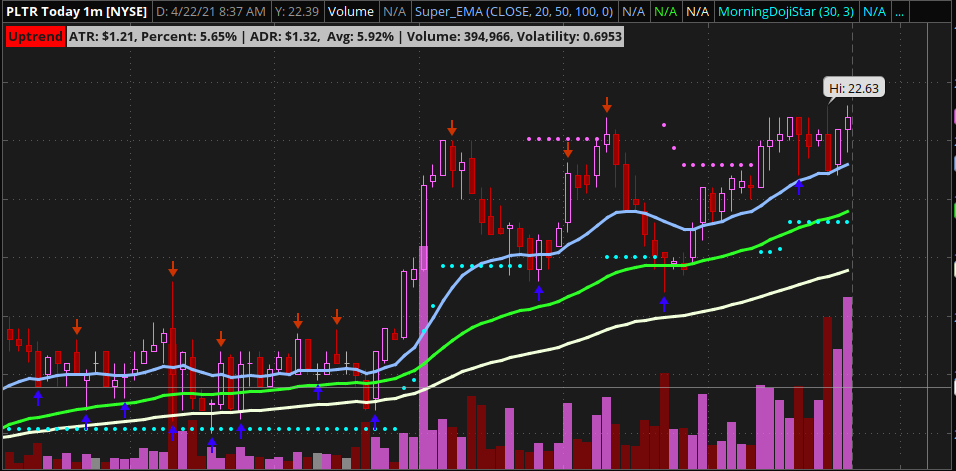

# Super EMA  

**Disclaimer:** _In order to demonstrate the functionality of my script, I used actual ticker symbols in the chart images. However, I do not make recommendations or determine the suitability of any security or strategy for individual traders. Any investment decision you make in your self-directed account is solely your responsibility. Be sure to backtest any strategy to determine if you understand the risks involved with each strategy._  

I wrote this for the ThinkorSwim:registered: platform. It is to be with your charts.  You can download this script from: [https://tos.mx/Yk58X5x](http://tos.mx/Yk58X5x)  

## Description  

I combined Three (3) Exponential Moving Averages (EMA) into one script. I then have them plot with three (3) different colors to help you identify them easier. You have to option to change each EMA to fit your style. I had set the default for each EMA as follows: EMA Small to 20, EMA Medium to 50, and EMA Large to 100.  As you can see from the image below what they look like:  
  
**Note:** _The labels at the upper left corner of this chart are from my script: [TOS_Trend_Indicator](https://www.github.com/TechRancher/TOS_Trend_Indicator/) and [Avg_Trade_Range_Label](https://www.github.com/TechRancher/Avg_Trade_Range_Label/)_  
The lower yellowish white line is the EMA 100, The middle green line is the EMA 50, the upper blue line is the EMA 20.  

### How To Use  

The strategy is for going long to have the blue EMA 20 above the green EMA 50 and have to green EMA 50 above the yellowish white EMA 100.  When the candle dips into or touches any of the EMA and the next candle climbs above the last candle then a buy is in play.  To go short the reverse is achieved with the EMA. The blue EMA 20 needs to be at the bottom with green EMA 50 above it. The green EMA 50 needs to be below the yellowish white EMA 100. When the candle climbs into or touches one of the EMA the next candle needs to below this one. Then a sell is in play.  I go into more detail with this strategy and my other indicators that you see in this chart at: [PivotOnEMA](https://www.github.com/TechRancher/PivotOnEMA/)

#### ThinkorSwim  

ThinkorSwim:registered: platform is owned by TD Ameritrade:tm:  You can download it for free from this link: [ThinkorSwim](https://www.tdameritrade.com/tools-and-platforms.page/)  
